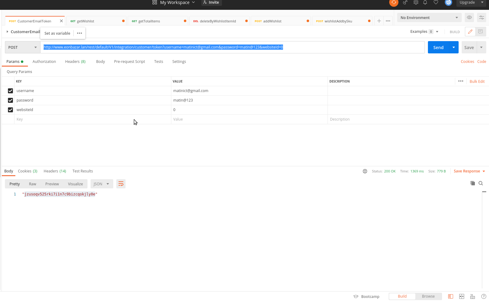
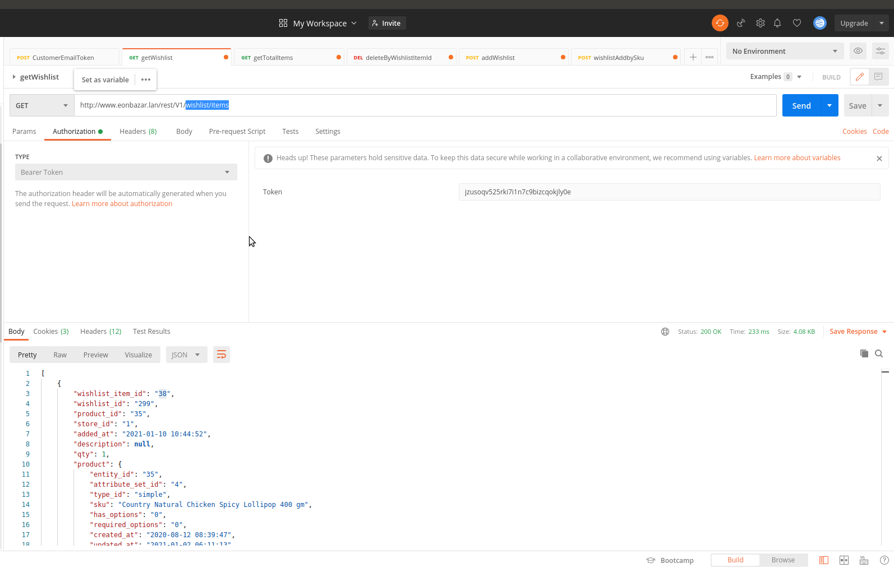
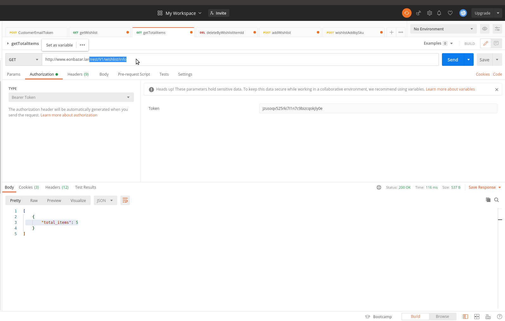
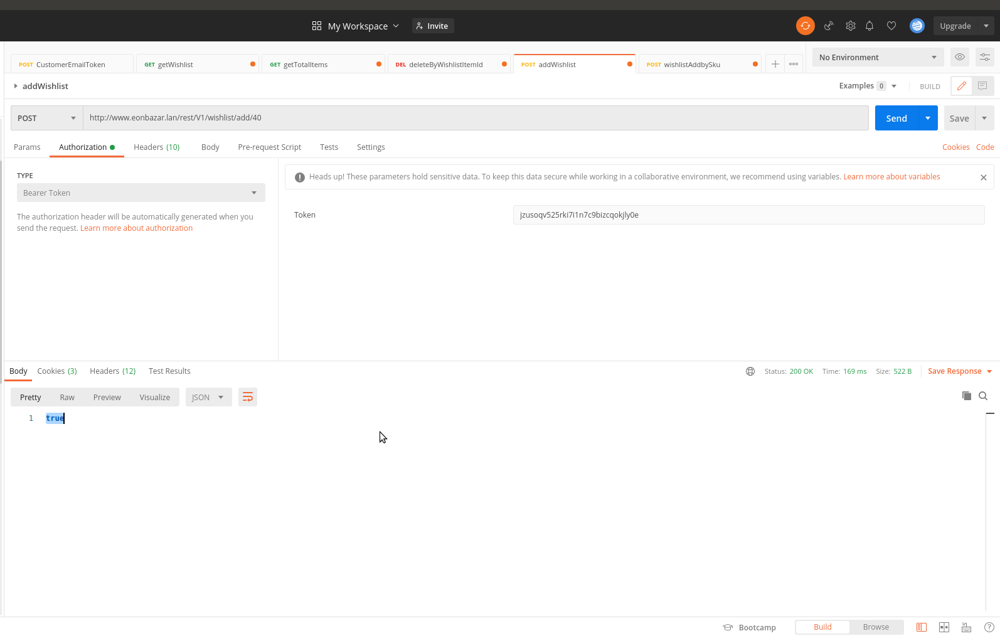
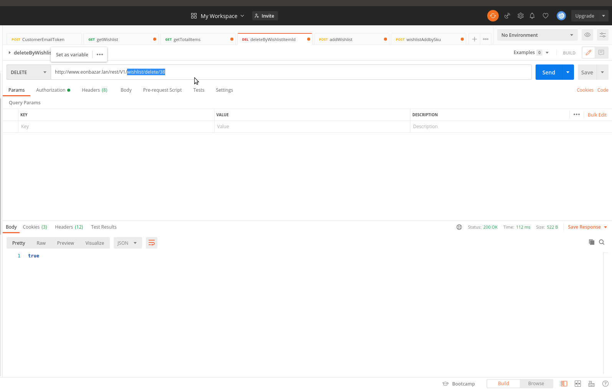

# Magento_Wishlist Api

By default [https://github.com/magento/magento2/tree/2.4-develop/app/code/Magento/Wishlist/etc](Magento 2 no Api end Point) but sometime it needed Specially when create iOS/Andriod apps for our Magento Store.

##

The Magento_Wishlist implements the Wishlist functionality.
This allows customers to create a list of products that they can add to their shopping cart to be purchased at a later date, or share with friends.

##

http://www.magento.lan/rest/default/V1/integration/customer/token?username=matinict@gmail.com&password=matin@123&websiteId=0
